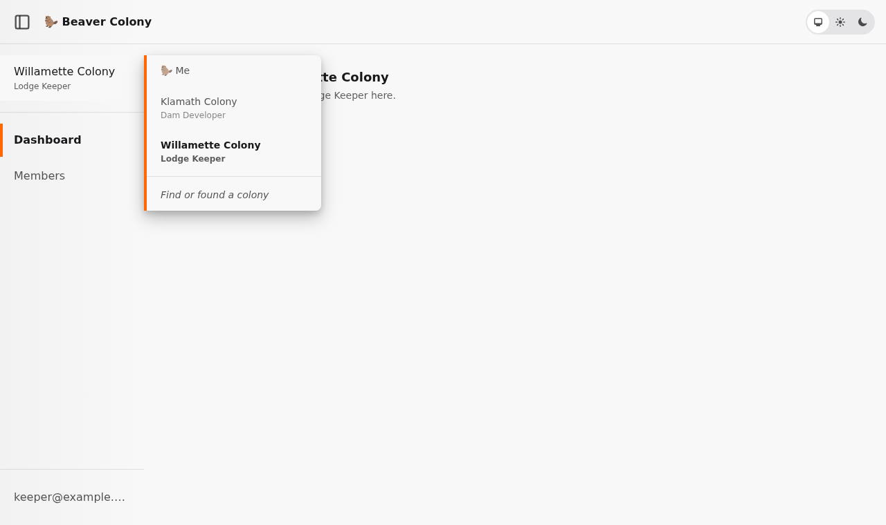

# Beaver Colony 🦫

A small Phoenix LiveView app about beavers who form colonies to build dams. It exists to teach three things:

1. **One LiveView, one job.** Navigating between LiveViews is a separate problem with its own architecture.
2. **Phoenix 1.8 Scopes.** `%Scope{}` carries who is asking, which colony they're in and what role they hold, and every context function takes it first.
3. **A secure multi-tenant sidebar.** It adapts to your role in the current colony and slides off and on screen.

The colony is the tenant. A beaver can belong to many colonies, with one role in each:

| Role | Can |
|---|---|
| **Dam Developer** | Founded the colony and runs it |
| **Lodge Keeper** | Approves new members, keeps the colony organized |
| **Builder** | Does the building |

Every account is a beaver, and every beaver has personal pages (`/me`) that belong to no colony.



## Running it

Requirements: Elixir 1.17+ and PostgreSQL.

```sh
mix setup        # deps, database, assets
mix phx.server   # http://localhost:4000
```

The database password defaults to `postgres`. If yours is different, set `PGPASSWORD` instead of editing config:

```sh
PGPASSWORD=secret mix setup
```

`mix setup` also seeds demo beavers, all with the password `beavers build dams`:
`dam@example.com`, `keeper@example.com` and `builder@example.com`.

Run the tests with `mix test`.

## The article series

The project is built from zero alongside a series of articles. `docs/journal.md` records the decisions as they're made.

## License

MIT. See [LICENSE](LICENSE).
